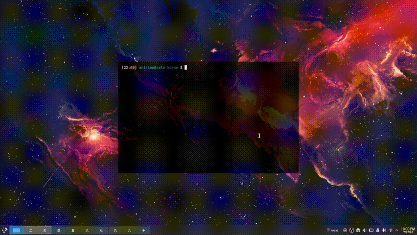

# KDEWE
[](https://opensource.org/licenses/MIT)

KDEWE is a CLI utility for the KDE Wallpaper Engine plugin



## Installation

* Clone the repo: `git clone https://github.com/Arisien/kdewe`

* Change directory: `cd kdewe`

* Compile binary: `g++ src/main.cc -o kdewe`

* Link binary: `ln -s /usr/bin/kdewe ./kdewe`

## Usage

* `kdewe [wallpaper id]`

## Configuration

* KDEWE is configured at `$HOME/.config/kdewe/config.json`. Configurations look something like this:

```json
{
    "STEAMDIR": "/home/user/.local/share/Steam"
}
```

## Todo

### Plugin

* Implement functions for configuring wallpaper and plugin in general

* Support changing to wallpaper of different type (scene -> video)

### JSON

* Implement JSONValue(null)

```c++
class _Null {};

#define null _Null();
```

* fully implement JSON_UNDEFINED into serializer and parser

* JSON constructor to support: 
```c++
JSON json({ {"pi", JSONValue(3.14)}, {"e", JSONValue(2.7)} });
```

## Contributors

* [Arisien](https://github.com/Arisien) - Main developer

## License
KDEWE is licensed under the [MIT](LICENSE) license. Feel free to fork the repository or modify the code as you see fit.
